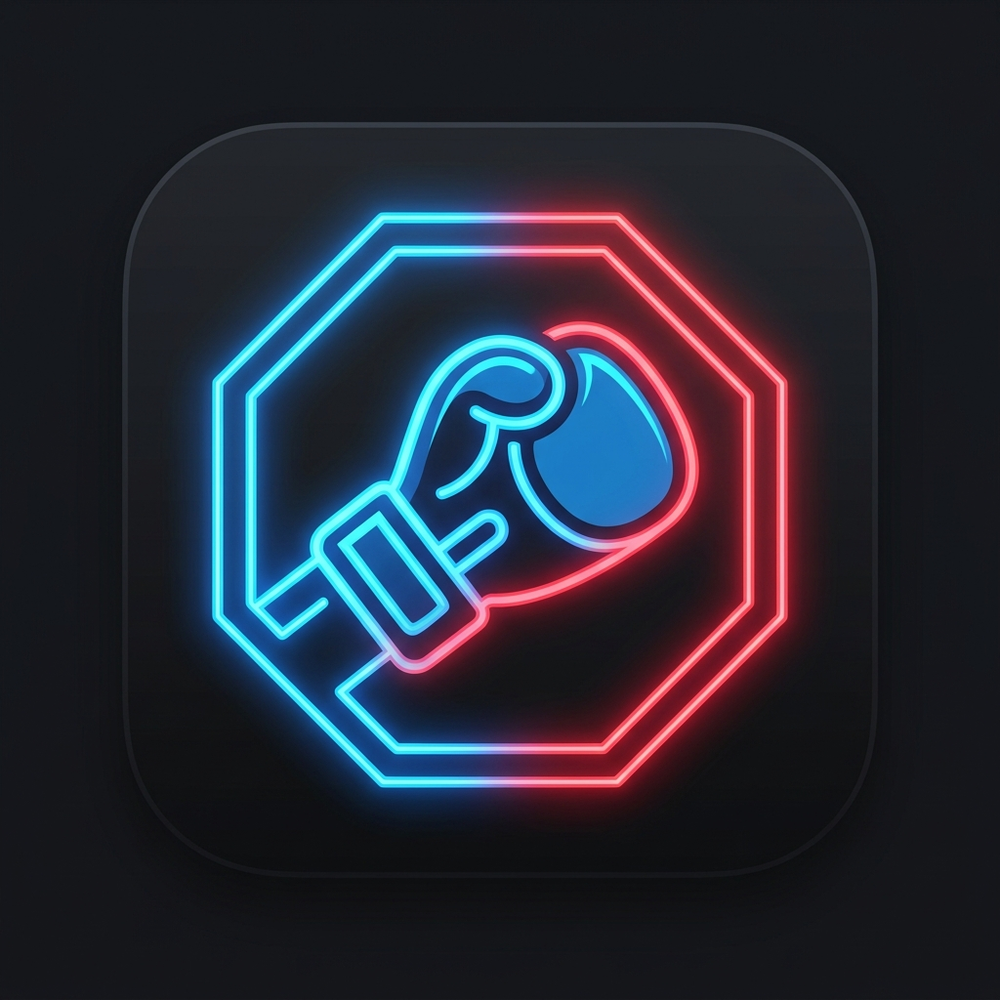

# UFC Fight Tracker for Home Assistant

  

A custom integration for Home Assistant that tracks UFC events, live fight results, and in-depth fighter statistics. Transform your smart home dashboard into the ultimate fight night companion!

## 💖 Support the Project

If you enjoy this integration and it makes your UFC fight nights better, consider buying me a coffee! It helps keep the API endpoints updated and supports future development.

---

## 🥊 Features

- **Live Scoreboard**: Follow live results, knockouts, submissions, and judge decisions in real-time.
- **Smart Polling**: Automatically adjusts its refresh rate based on the event status so you get instant updates during a fight without hammering the API during the week.
- **Rich Fighter Stats**: Pulls detailed athlete metrics including height, weight, reach, stance, striking accuracy, takedown averages, and submission averages.
- **Auto-Generated Sensors**: Instantly creates exactly 15 sensors (`sensor.ufc_fight_tracker_00` to `14`) mapping exactly to the fight card for a seamless dashboard experience.
- **Event Lifecycle Tracking**: Automatically transitions between past, live, and upcoming events.

---

## 🖥️ UI & Dashboards

**Important:** This integration operates exclusively as a backend data provider. It creates exactly 15 sensors containing detailed UFC fight data, but it does **not** create a graphical card by itself.

To view the data on your Home Assistant dashboard in a beautiful, visual layout, you have three options:
1. **[UFC Fight Tracker Card](https://github.com/FadhelChaabane/ufc-fight-tracker-cards)** (Recommended): A custom Lovelace card built specifically for this integration by the same author, providing a pixel-perfect, rich MMA UI.
2. **[Team Tracker Card](https://github.com/vasqued2/ha-teamtracker-card)**: A popular community card that supports this integration (with limited compatibility).
3. **Custom HTML/CSS**: Build your own custom markdown or picture-elements cards using the rich sensor attributes provided.

---

## 🧠 How It Works: The Logic

### Why 15 Sensors?
The integration generates exactly 15 sensors (`sensor.ufc_fight_tracker_00` to `14`) for every single event. Here is why and how to use them:
- **Maximum Card Size**: A combined UFC event (Main Card + Prelims) almost never exceeds 15 fights. 
- **Empty Sensors**: If an event only has 13 fights, the remaining 2 sensors (`13` and `14`) will simply default to empty/null values.
- **Predictable Ordering**: The sensors are reverse-chronological. `sensor.ufc_fight_tracker_00` is **always** the Main Event, and `sensor.ufc_fight_tracker_01` is **always** the Co-Main Event.
- **UI Filtering**: Every sensor has a `cardSegment` attribute (e.g., `Main Card`, `Prelims`). You can use this attribute in your Lovelace cards (like `auto-entities`) to dynamically group and filter the fights visually!

### Event Selection
You don't need to manually tell the integration which event to track. Behind the scenes, the integration looks at a sliding window of **a configurable number of days in the past (default 3) up to 30 days in the future**. It then locks onto an event using strict priorities:

1. **Live Event (Highest Priority)**: If an event is currently happening, the tracker instantly locks onto it.
2. **Finished Event**: If no events are live, it checks if an event just finished. It will display the final results of a finished event for your configured number of days.
3. **Upcoming Event**: Once the configured "keep days" have passed since the last event, it automatically shifts focus to the next scheduled upcoming event.

### Smart Refresh Logic
To guarantee lightning-fast updates without being abusive to network APIs, the integration uses a dynamic "Smart Polling" algorithm. It changes its own refresh speed based on what is happening:

- **Idle (Days before the fight)**: Refreshes once every 24 hours.
- **Fight Day (Within 6 hours of the start)**: Refreshes once every hour.
- **Prelims (Live)**: Refreshes every 30 seconds.
- **Intermission**: If the prelims end early, the integration pauses and calculates the exact wait time until the Main Card starts, putting itself to sleep to save resources.
- **Main Card (Live)**: Refreshes every 30 seconds until the event fully concludes.
- **Post-Fight**: Drops back to refreshing once a day.

---

## 📊 Sensor Attributes

The integration offers two operation modes: **Lite** and **Full Stats**, which can be configured during installation or via the integration options.

- **Lite Mode**: Pulls basic fight, event, and scoreboard information. Optimized for lower network usage.
- **Full Stats Mode**: Pulls everything in Lite mode, plus detailed, deep-dive athletic metrics for each fighter (height, reach, striking accuracy, takedown averages, etc.).

| Attribute Name | Mode | Explanation |
|---|---|---|
| `state` | Lite | Current state of the event (`PRE`, `IN`, `POST`) |
| `event_name` | Lite | Name of the UFC event (e.g., `UFC 300: Pereira vs. Hill`) |
| `event_type` | Lite | Position on the card (e.g., `Main Event`, `Event 2`) |
| `weight_class` | Lite | The weight class abbreviation |
| `period` | Lite | The current or final round of the fight |
| `displayClock` | Lite | The current or final clock time of the round |
| `cardSegment` | Lite | Card segment (e.g., `Main Card`, `Prelims`, `Early Prelims`) |
| `last_play` | Lite | Method of victory and details without winner name (e.g., `KO/TKO (Round 1 @ 3:14)`) |
| `win_type` | Lite | The raw finish or decision type (e.g., `KO/TKO`, `Majority Draw`, `Split Decision`) |
| `score_card` | Lite | The judges' scores if the fight went to a decision (e.g., `29-28, 28-29, 29-28`) |
| `team_name` / `opponent_name` | Lite | The display name of Fighter 1 and Fighter 2 |
| `team_score` / `opponent_score` | Lite | The current score/points for each fighter |
| `team_winner` / `opponent_winner` | Lite | Boolean indicating if the fighter won the bout |
| `team_logo` / `opponent_logo` | Lite | URL to the fighter's country flag |
| `team_headshot` / `opponent_headshot` | Lite | URL to the fighter's headshot image |
| `team_fullBodyLeft` / `_Right` | Lite | URL to full body transparent images (if available) |
| `team_record` / `opponent_record` | Lite | The overall fight record of the fighter (e.g., `33-11-0`) |
| `team_height` / `opponent_height` | Full Stats | The fighter's height (e.g., `6' 4"`) |
| `team_weight` / `opponent_weight` | Full Stats | The fighter's weight (e.g., `205 lbs`) |
| `team_age` / `opponent_age` | Full Stats | The fighter's age |
| `team_reach` / `opponent_reach` | Full Stats | The fighter's arm reach |
| `team_stance` / `opponent_stance` | Full Stats | The fighter's fighting stance (e.g., `Orthodox`, `Southpaw`) |
| `team_sigStrikeLpm` / `opponent_sigStrikeLpm` | Full Stats | Significant strikes landed per minute |
| `team_sigStrikeAcc` / `opponent_sigStrikeAcc` | Full Stats | Significant striking accuracy percentage |
| `team_takedownAvg` / `opponent_takedownAvg` | Full Stats | Average takedowns landed per 15 minutes |
| `team_takedownAcc` / `opponent_takedownAcc` | Full Stats | Takedown accuracy percentage |
| `team_submissionAvg` / `opponent_submissionAvg` | Full Stats | Average submissions attempted per 15 minutes |

---

## ⚙️ Installation & Setup

### HACS Installation (Recommended)
1. Open HACS in your Home Assistant instance.
2. Click the 3 dots in the top right corner and select **Custom repositories**.
3. Add the URL of this repository and select **Integration** as the category.
4. Click **Install** on the newly added UFC Fight Tracker integration.
5. Restart Home Assistant.
6. Go to **Settings > Devices & Services > Add Integration**.
7. Search for **UFC Fight Tracker** and install it.

### Manual Installation
1. Download or clone this repository.
2. Copy the `custom_components/ufc_fight_tracker` folder into your Home Assistant `config/custom_components` directory.
3. Restart Home Assistant.
4. Go to **Settings > Devices & Services > Add Integration**.
5. Search for **UFC Fight Tracker** and install it. 

*(No complex YAML configuration required!)*

---

## ⚖️ Legal Disclaimer & Copyright Notice

**Disclaimer of Affiliation:**
This integration is a community-driven, open-source project and is **NOT** affiliated with, endorsed by, or sponsored by the Ultimate Fighting Championship (UFC), Zuffa LLC, TKO Group Holdings, ESPN, or the Walt Disney Company.

**Data Source:**
All data, imagery, headshots, and statistics utilized within this integration are dynamically retrieved from the public-facing ESPN Core APIs. 

**Copyrights & Trademarks:**
- **UFC®** and all associated logos, branding, and fighter names are registered trademarks and copyrights of Zuffa LLC and its affiliates.
- **ESPN®** and its associated logos are registered trademarks and copyrights of ESPN Enterprises, Inc.
- All fighter images, headshots, and event data remain the exclusive intellectual property of their respective owners. 

This tool is strictly for personal, non-commercial use within local smart home environments. The developers assume no liability for the usage of this software or the data it consumes.
